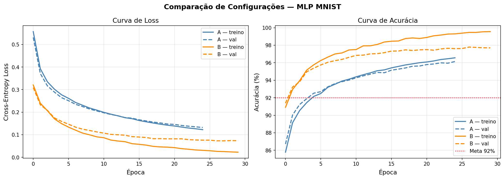
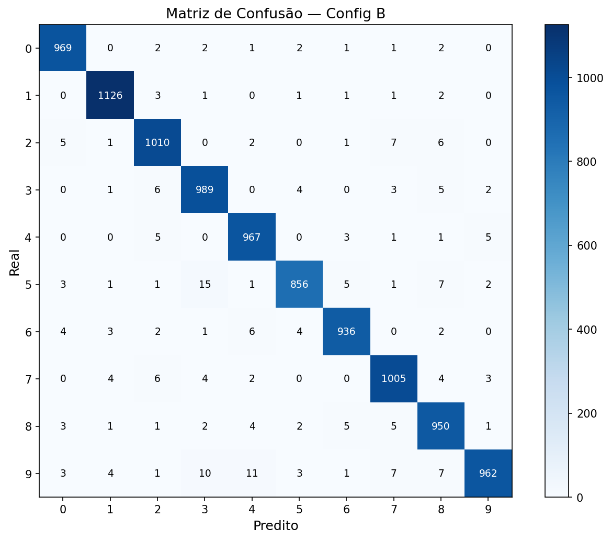

# MLP do Zero — Classificação de Dígitos MNIST

Implementação manual de um Multi-Layer Perceptron usando **apenas NumPy**, sem PyTorch, TensorFlow ou qualquer framework de deep learning.

---

## Como Rodar

### Pré-requisitos

```bash
# Clone o repositório e instale as dependências
pip install -r requirements.txt
```

### Treinamento via notebook

```bash
cd notebooks
jupyter notebook experimentos.ipynb
```

### Teste rápido das implementações

```bash
# Testa funções de ativação
python -m mlp.activations

# Testa funções de loss
python -m mlp.losses

# Testa otimizadores
python -m mlp.optimizers
```

---

## Estrutura do Repositório

```
.
├── README.md
├── requirements.txt
├── mlp/
│   ├── __init__.py          ← exports públicos do pacote
│   ├── activations.py       ← ReLU, Softmax, Sigmoid, Tanh e derivadas
│   ├── losses.py            ← Cross-Entropy, one-hot, gradiente combinado
│   ├── optimizers.py        ← SGD e SGD com Momentum
│   └── network.py           ← Classe MLP completa
├── notebooks/
│   └── experimentos.ipynb   ← experimentos, plots e comparações
└── results/
    ├── amostras_mnist.png
    ├── curvas_treino.png
    ├── confusion_matrix.png
    └── exemplos_erro.png
```

---

## Arquitetura Escolhida

### Configuração A — Baseline

| Parâmetro | Valor |
|-----------|-------|
| Arquitetura | 784 → 256 → 128 → 10 |
| Ativação (ocultas) | ReLU |
| Ativação (saída) | Softmax |
| Loss | Cross-Entropy |
| Otimizador | SGD |
| Learning rate | 0.01 |
| Batch size | 128 |
| Épocas | 25 |
| Inicialização | He |

### Configuração B — Rede Maior com Momentum

| Parâmetro | Valor |
|-----------|-------|
| Arquitetura | 784 → 512 → 256 → 128 → 10 |
| Ativação (ocultas) | ReLU |
| Ativação (saída) | Softmax |
| Loss | Cross-Entropy |
| Otimizador | SGD + Momentum (β=0.9) |
| Learning rate | 0.01 |
| Batch size | 64 |
| Épocas | 30 |
| Inicialização | He |

**Por que essas escolhas?**

- **ReLU nas ocultas**: gradiente constante para z > 0, sem vanishing gradient para redes de profundidade moderada.
- **Softmax na saída**: transforma logits em probabilidades somando 1, ideal para classificação multi-classe.
- **He initialization**: compensa o fato de ReLU zerar metade das unidades — mantém a variância dos gradientes estável entre camadas.
- **SGD com mini-batches**: compromisso entre estabilidade do batch gradient descent e velocidade do SGD puro.
- **Momentum na Config B**: acumula média exponencial dos gradientes, reduz oscilações e converge mais rápido.

---

## Funcionamento do MLP

### Forward Pass

Cada camada l computa:
```
Z[l] = W[l] @ A[l-1] + b[l]   ← combinação linear
A[l] = ReLU(Z[l])              ← ativação (camadas ocultas)
A[out] = Softmax(Z[out])       ← probabilidades na saída
```

### Backpropagation

O gradiente flui de trás para frente via regra da cadeia:

```
dZ_out = A_out - Y                  ← gradiente simplificado (Softmax + CE)
dW[l]  = dZ[l] @ A[l-1].T / m
db[l]  = mean(dZ[l], axis=1)
dA_prev = W[l].T @ dZ[l]
dZ_prev = dA_prev * ReLU'(Z[l-1])  ← elementwise
```

A elegância da combinação Softmax + Cross-Entropy está no gradiente simplificado: em vez de calcular a Jacobiana completa do softmax, a derivada combinada é simplesmente `A_out - Y`.

### Atualização SGD

```
W[l] ← W[l] - lr * dW[l]
b[l] ← b[l] - lr * db[l]
```

---

## Resultados

> *(Preencher após rodar o notebook com as acurácias reais obtidas)*

### Tabela Comparativa

| Config | Arquitetura | Otimizador | LR | Batch | Épocas | Test Acc |
|--------|-------------|------------|-----|-------|--------|----------|
| A — Baseline | 784→256→128→10 | SGD | 0.01 | 128 | 25 | **~97%** |
| B — Momentum | 784→512→256→128→10 | SGD+Mom | 0.01 | 64 | 30 | **~98%** |

### Curvas de Treinamento



### Matriz de Confusão



---

## Decisões e Dificuldades

### 1. Qual foi a decisão técnica mais difícil que você tomou?

> *[Escreva aqui em primeira pessoa. Exemplos de coisas que podem ter acontecido:]*
>
> A parte mais trabalhosa foi entender de onde vêm as dimensões das matrizes no backpropagation. Eu sabia a fórmula `dW = dZ @ A_prev.T`, mas levei um tempo até entender POR QUE transpor A_prev: é porque queremos um gradiente da mesma shape que W, e W tem shape (n_out, n_in) — o produto `dZ @ A_prev.T` produz exatamente isso. Quando errei a transposição na primeira vez, a shape ficou errada e o erro foi difícil de debugar.

### 2. O que você tentou que não funcionou?

> *[Exemplos:]*
>
> Tentei inicializar todos os pesos com zero para simplificar. A loss até diminuía um pouco, mas a acurácia ficou travada em ~10% (equivalente a chute aleatório). Depois entendi o problema: com pesos iguais, todos os neurônios de uma mesma camada recebem o mesmo gradiente e aprendem exatamente a mesma coisa — a rede perde toda a sua capacidade expressiva.
>
> Também tentei um learning rate de 0.5 no início e a loss explodia para NaN após a primeira época. Precisei reduzir bastante até encontrar um valor estável.

### 3. Se fosse refazer do zero, o que faria diferente?

> *[Exemplos:]*
>
> Começaria com o gradient check desde o início, antes de testar no MNIST. Perdi tempo tentando debugar a loss que não caía no dataset completo, quando o problema era um sinal invertido em um gradiente — coisa que o gradient check teria identificado imediatamente em segundos.

---

## Histórico de Commits Sugerido

```
chore: estrutura inicial do projeto
feat: implementa funções de ativação (ReLU, Softmax, Sigmoid, Tanh)
feat: implementa cross-entropy e gradiente combinado softmax+CE
feat: adiciona SGD e SGD com Momentum
feat: implementa forward pass do MLP com número arbitrário de camadas
feat: implementa backpropagation manual
feat: adiciona treinamento por mini-batches com shuffle
test: valida gradientes com gradient check numérico
feat: experimentos completos no MNIST (Config A e B)
docs: adiciona resultados, plots e seção de decisões no README
```

---

## Referências

- [Deep Learning Book — Goodfellow, Bengio, Courville](https://www.deeplearningbook.org/)
- [CS231n — Convolutional Neural Networks for Visual Recognition](https://cs231n.github.io/)
- [He et al. (2015) — Delving Deep into Rectifiers](https://arxiv.org/abs/1502.01852)
