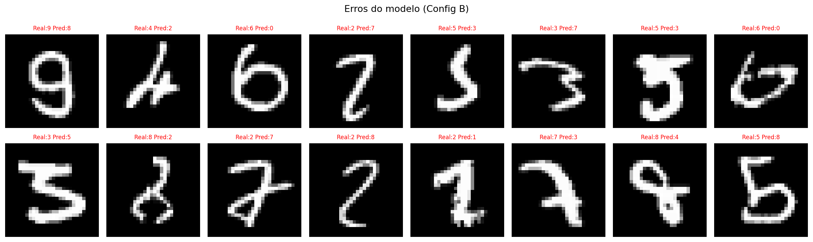

# MLP do Zero — Classificação de Dígitos MNIST

Implementação manual de um **Multi-Layer Perceptron** para classificar dígitos manuscritos do dataset **MNIST**.

A rede neural foi implementada com **NumPy**, sem PyTorch, TensorFlow, Keras, JAX ou frameworks de deep learning. Bibliotecas auxiliares, como Matplotlib e Scikit-learn, foram usadas apenas para visualização e análise dos resultados, não para construir ou treinar o modelo.

---

## Como Rodar

### Pré-requisitos

```bash
pip install -r requirements.txt
```

### Treinamento via notebook

```bash
cd notebooks
jupyter notebook experimentos.ipynb
```

### Teste rápido das implementações

```bash
python -m mlp.activations
python -m mlp.losses
python -m mlp.optimizers
```

---

## Estrutura do Repositório

```txt
.
├── README.md
├── requirements.txt
├── mlp/
│   ├── __init__.py          ← exports públicos do pacote
│   ├── activations.py       ← ReLU, Softmax, Sigmoid, Tanh e derivadas
│   ├── losses.py            ← Cross-Entropy, one-hot e gradiente combinado
│   ├── optimizers.py        ← SGD e SGD com Momentum
│   ├── network.py           ← classe MLP completa
│   └── data.py              ← carregamento do MNIST em formato IDX
├── notebooks/
│   └── experimentos.ipynb   ← experimentos, plots e comparações
└── results/
    ├── amostras_mnist.png
    ├── curvas_treino.png
    ├── confusion_matrix.png
    └── exemplos_erro.png
```

## Arquiteturas Avaliadas

### Configuração A — Baseline

| Parâmetro | Valor |
|---|---|
| Arquitetura | 784 → 256 → 128 → 10 |
| Camadas ocultas | 2 |
| Ativação nas ocultas | ReLU |
| Ativação na saída | Softmax |
| Loss | Cross-Entropy |
| Otimizador | SGD |
| Learning rate | 0.01 |
| Batch size | 128 |
| Épocas | 25 |
| Inicialização | He |

### Configuração B — Rede Maior com Momentum

| Parâmetro | Valor |
|---|---|
| Arquitetura | 784 → 512 → 256 → 128 → 10 |
| Camadas ocultas | 3 |
| Ativação nas ocultas | ReLU |
| Ativação na saída | Softmax |
| Loss | Cross-Entropy |
| Otimizador | SGD + Momentum |
| Momentum | 0.9 |
| Learning rate | 0.01 |
| Batch size | 64 |
| Épocas | 30 |
| Inicialização | He |

---

## Por Que Essas Escolhas?

- **ReLU nas camadas ocultas**: é simples, eficiente e ajuda a reduzir o problema de vanishing gradient em redes de profundidade moderada.
- **Softmax na saída**: transforma os logits em probabilidades para as 10 classes do MNIST.
- **Cross-Entropy**: é adequada para problemas de classificação multiclasse.
- **He Initialization**: foi escolhida por funcionar bem com ReLU, ajudando a manter a variância dos sinais mais estável entre as camadas.
- **Mini-batches**: tornam o treinamento mais eficiente do que usar o dataset inteiro a cada atualização.
- **Momentum na Configuração B**: ajuda a reduzir oscilações no treinamento e melhora a convergência.

---

## Funcionamento do MLP

### Forward Pass

Cada camada calcula uma combinação linear seguida de uma ativação.

```txt
Z[l] = W[l] @ A[l-1] + b[l]
A[l] = ReLU(Z[l])
```

Na camada de saída:

```txt
Z[out] = W[out] @ A[última_oculta] + b[out]
A[out] = Softmax(Z[out])
```

A saída final possui 10 valores, representando a probabilidade de a imagem pertencer a cada dígito de 0 a 9.

---

## Backpropagation

O backpropagation foi implementado manualmente usando a regra da cadeia.

Como a saída usa Softmax junto com Cross-Entropy, o gradiente da última camada pode ser simplificado:

```txt
dZ_out = A_out - Y
```

Para as demais camadas:

```txt
dW[l] = dZ[l] @ A[l-1].T / m
db[l] = mean(dZ[l], axis=1)
dA_prev = W[l].T @ dZ[l]
dZ_prev = dA_prev * ReLU'(Z[l-1])
```

Essa etapa foi uma das partes mais importantes da atividade, porque é nela que a rede calcula como cada peso contribuiu para o erro final.

---

## Atualização dos Pesos

A atualização com SGD segue a fórmula:

```txt
W[l] = W[l] - learning_rate * dW[l]
b[l] = b[l] - learning_rate * db[l]
```

Na Configuração B também foi testado SGD com Momentum, que acumula uma média dos gradientes anteriores para suavizar as atualizações.

---

## Resultados

A atividade pedia pelo menos **92% de acurácia no conjunto de teste**.

As duas configurações ultrapassaram essa meta.

| Configuração | Arquitetura | Otimizador | LR | Batch | Épocas | Test Loss | Test Acc |
|---|---|---|---:|---:|---:|---:|---:|
| A — Baseline | 784 → 256 → 128 → 10 | SGD | 0.01 | 128 | 25 | 0.1318 | 96.14% |
| B — Momentum | 784 → 512 → 256 → 128 → 10 | SGD + Momentum | 0.01 | 64 | 30 | 0.0732 | 97.70% |

A melhor configuração foi a **Configuração B**, com **97.70% de acurácia no teste**.

---

## Curvas de Treinamento


As curvas mostram que:

- a loss diminuiu ao longo das épocas;
- a acurácia aumentou de forma consistente;
- a Configuração B teve melhor desempenho final;
- ambas as configurações superaram a meta de 92%.

---

## Matriz de Confusão


A matriz de confusão foi usada para analisar os erros da melhor configuração. A maior parte das classificações ficou concentrada na diagonal principal, indicando que o modelo classificou corretamente a maioria das imagens.

Os erros ocorreram principalmente em dígitos visualmente parecidos ou escritos de forma ambígua.

---

## Exemplos de Erros



A visualização dos erros ajuda a entender melhor as limitações do modelo. Alguns dígitos classificados incorretamente possuem traços confusos até mesmo para uma pessoa, o que torna o erro mais compreensível.

---

## Validação dos Gradientes

Para verificar se o backpropagation estava correto, foi implementado um **gradient check numérico**.

A ideia foi comparar o gradiente calculado pelo backpropagation com uma aproximação numérica usando diferença central:

```txt
grad_aproximado = (J(θ + ε) - J(θ - ε)) / (2ε)
```

Resultado obtido:

```txt
Diferença máxima relativa: 7.35e-10
```

Como esse valor é muito pequeno, considerei que os gradientes estavam corretos. Esse teste foi importante porque ajudou a validar matematicamente a implementação do backpropagation.

---

## Observação Sobre o Uso do Conjunto de Teste

No notebook, o conjunto de teste foi usado como referência para acompanhar a acurácia ao longo das épocas. Porém, ele **não foi usado para atualizar os pesos**.

A atualização dos pesos acontece apenas com os mini-batches do conjunto de treino.

Se fosse uma versão mais rigorosa experimentalmente, eu separaria um conjunto específico de validação a partir do treino, deixando o conjunto de teste apenas para a avaliação final.

---

## Decisões e Dificuldades

### 1. Qual foi a decisão técnica mais difícil?

A parte mais trabalhosa foi entender de onde vêm as dimensões das matrizes no backpropagation.

Eu sabia a fórmula:

```txt
dW = dZ @ A_prev.T
```

Mas levei um tempo até entender por que era necessário transpor `A_prev`.

A explicação é que `dW` precisa ter exatamente o mesmo formato de `W`. Como `W` tem shape:

```txt
(n_out, n_in)
```

o produto `dZ @ A_prev.T` gera justamente uma matriz nesse formato.

Quando errei essa transposição, os shapes não batiam e o erro foi difícil de debugar.

---

### 2. O que eu tentei que não funcionou?

No começo, tentei inicializar todos os pesos com zero para simplificar.

Isso não funcionou porque todos os neurônios de uma mesma camada recebiam os mesmos gradientes e aprendiam exatamente a mesma coisa. Como consequência, a rede perdia capacidade de aprendizado e a acurácia ficava próxima de um chute aleatório.

Também testei um learning rate muito alto. Quando usei valores maiores, a loss ficou instável e chegou a explodir para `NaN`. Depois reduzi o valor e encontrei um treinamento mais estável com `0.01`.

---

### 3. O que eu faria diferente se fosse refazer?

Se eu fosse refazer o projeto do zero, começaria pelo gradient check antes de treinar no MNIST completo.

Eu perdi tempo tentando debugar a loss no dataset inteiro, quando o problema poderia ser identificado mais rápido usando uma rede pequena e poucos exemplos.

Também separaria um conjunto específico de validação a partir do treino, deixando o conjunto de teste apenas para a avaliação final.

## Referências

- [Deep Learning Book — Goodfellow, Bengio, Courville](https://www.deeplearningbook.org/)
- [CS231n — Convolutional Neural Networks for Visual Recognition](https://cs231n.github.io/)
- [He et al. (2015) — Delving Deep into Rectifiers](https://arxiv.org/abs/1502.01852)
- [MNIST Dataset](http://yann.lecun.com/exdb/mnist/)
